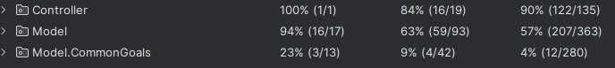
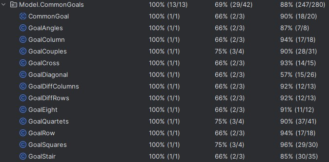

# Prova Finale di Ingegneria del Software - AA 2022-2023


Implementation of the tabletop game: [MyShelfie](https://www.craniocreations.it/prodotto/my-shelfie).

---

## Tools used

| Tool  | Description                                                                                                                                                                             |
|-----------------|-------------------------------------------------------------------------------------------------------------------------------------------------------------------------------|
| IntelliJ IDEA   | Integrated development environment (IDE) written in Java for developing computer software written in Java, Kotlin, Groovy, and other JVM-based languages.                     |
| Docker          | Set of platform as a service (PaaS) products that use OS-level virtualization to deliver software in packages called containers.                                              |
| Draw.io         | is free online diagram software for making flowcharts, process diagrams, org charts, UML, ER and network diagram                                                              | 


## Libreries and Plugins

| Library/Plugin  | Description                                                                |
|-----------------|----------------------------------------------------------------------------|
| Maven           | Build automation tool used primarily for Java projects                     |
| JUnit           | Unit testing framework for the Java programming language                   |
| JavaFx          | Software platform for creating and delivering desktop applications         |

---

## Functionalities

| Functionality       | Implemented         |
|---------------------|---------------------|
| Simplified rules    | :green_square:      |
| Complete rules      | :green_square:      |
| Socket              | :green_square:      |
| RMI                 | :green_square:      |
| Tui                 | :green_square:      |
| Gui                 | :green_square:      |

| Advanced Functionalities       | Implemented        |
|--------------------------------|--------------------|
| Multiple matches               | :green_square:     |
| Chat                           | :green_square:     |
| Persistence                    | :red_square:       |
| Resilience to disconnections   | :green_square:     |

---

## Tests

These are screenshot directly from intellij showing coverage for our tests, since the common goals are so many and each match doesn't use more than two of them, we decided to test them separately 

Percentage coverages for classes, methods and lines of code:



---


# Running the app

## JAR
It's possible to just run the jar:
- [Latest release](https://github.com/Comodaino/ing-sw-2023-spineto-solbiati-spezzi-romano/releases/latest)
 
### To execute the both client and server just execute the jar with (127.0.0.1 will be the default ip on which the client tries to connect): 

```
java -jar myshelfie.jar
```

### It's possible to add  various parameters to the command in any order

```
-t to select "client" or "server"
-v to select type of view: "TUI" or "GUI"
-i to insert a ip address
-c to select type of connection: "socket" or "RMI"
-Xmx to increase max RAM usage, suggested for GUI (example: -Xmx2G)

```

### example:
```
java -jar myshelfie.jar -t client -c socket -v TUI -i localhost
```


## Docker
It's also possible to run the app on a docker container, this was done to find any compatibility issues and that the jar was built correctly,
the jar was also tested on two different fresh installation of linux with a different distro (arch and garuda)

To build the container: 
```
sudo docker build -t nameOfTheImage .
```
To run the container: 
```
sudo docker run -p -i -t nameOfTheImage
```
Docker is required to create and run the image, to create the image copy in a new folder both Dockerfile and the jar executable

---

## Group members:

- [_**Spineto Alessio**_](https://github.com/Comodaino)
- [_**Solbiati Nicoló**_](https://github.com/NicoSolbia)
- [_**Spezzi Clara**_](https://github.com/claraspezzi)
- [_**Romano Alessandra**_](https://github.com/Aleromano01)
